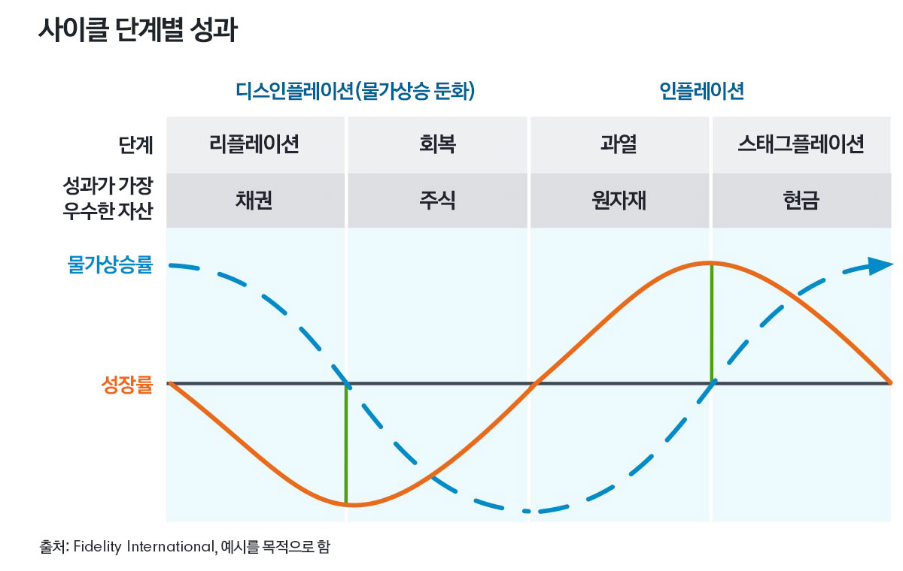

# knu-intern

| process | Link | Description |
|:--:|:--|:--|
| 00 | [draftProposal](./draftProposal) | 데이터 분석 기획 및 기안서 작성 |
| 01 | [defineDataRequirements](./dataRequirements) | 목표 및 데이터 요구사항 정의 |
| 02 | [dataPreprocessing](./dataPreprocessing/) | 데이터 수집 및 전처리 |

## 경기 순환은 왜 일어날까?

  
경제는 자연 실업률 상태에 안정적으로 머물러 있지 않고 변동한다. 경제는 경제 활동이 활발하여 실업률이 낮고, 성장률은 높으며, 국민소득의 크기가 커지는 호황 상태에 놓이기도 한다. 호황 상태에서 경제 활동이 점차로 위축되어 나갈 때를 가리켜 경기가 후퇴한다고 한다. 경기 후퇴가 심해지면 경제는 침체 상태에 놓이게 된다. 침체가 심할 때를 가리켜 불황이라고 부른다. 경기 침체 상태에서 경제 활동은 위축되고, 실업률은 높아지며, 성장률은 낮아진다. 경제가 침체 상태를 벗어나 경제 활동이 다시 활발해지기 시작하는 국면이 오게 되는데, 이를 경기 회복이라고 부른다. 이처럼 경제 상황이 변동 순환하는 현상을 가리켜 경기 변동 또는 경기 순환이라고 한다.   
<차세대 고등학교 경제 318쪽>

### 경기변동의 주요 원인으론 '수요 충격'과 '공급 충격'이 꼽힌다.

> 수요 충격은 경제에 대한 비관적인 전망으로 총수요(가계 기업 정부가 구매하려는 재화와 서비스의 총량)가 감소하는 것을 말한다.  
공급 충격은 기업들의 생산비용이 급증해 총공급(한 국가의 기업들이 생산해 판매하려는 재화와 서비스의 총량)이 감소하는 것이다.  
과잉생산과 과잉소비

### 경기를 진단하고 예측하는 공식적인 방법
> 이미 발표된 경제지표를 이용하는 방법,종합경기지표를 작성하는 방법,설문조사에 의한 방법 등

이러한 현상은 반복해서 나타나게 되나 주기적인 것은 아닙니다.
[<통계청>](https://kostat.go.kr/board.es?mid=a10502050100&bid=3216&act=view&list_no=306625&tag=&nPage=1&ref_bid=)

## 장기 부채 사이클(Long Term Dept Cycle)

### 1. 버블이 나타나는 원인 - 사람들의 낙관  

  
  사람들의 부채가 계속 증가함에도 불구하고 대출기관은 신용을 더 늘릴 수 있습니다. 왜 그럴까요? 사람들은 기본적으로 낙관적으로 생각하기 때문입니다.
  모든 것이 잘 돌아갈 것이라고 생각하는 경향이 있습니다.

  사람들은 최근에 무슨 일이 일어났는지 대해서만 관심을 가지고 있습니다. 그렇다면 최근에 무슨 일이 있었을까요?  

  소득이 증가했고 자산가치가 올랐고 주식시장이 상승했습니다. 따라서 대출을 통해 상품, 서비스, 금융자산을 계속해서 구입해도 괜찮다고 생각하게 됩니다.  
  사람들이 이와 같이 생각하고 행동할 때, 우리는 이를 거품이라고 부릅니다.

 

### 2. 거품이 지속될 수 없는 이유 - 부채 부담의 증가

`부채 부담(Debt Burden)`이란 부채와 소득의 비율, 소득이 증가한다면 부채 부담을 관리할 수 있습니다. 동시에 자산가치는 상승합니다. 이에 사람들은 엄청난 금액을 빌려서(대출해서) 투자 수단으로 자산을 매입하려고 합니다. 이는 자산가격을 더 상승시키는 원인이 됩니다.

부채가 상당히 많이 쌓여있지만, 자산가치 상승으로 인해 사람들은 부유하다는 느낌을 받게 됩니다.  
소득과 자산가치 상승은 대출자의 신용도를 장기간 동안 좋은 상태로 유지시켜 줍니다.

수십년 간 부채부담은 천천히 증가하기 시작합니다. 부채 상환 규모도 점점 커지게 됩니다. 어느 시점에 도달하면 부채 상환이 소득보다 더 빠르게 증가하기 시작합니다.  
이때 사람들은 비로소 지출을 줄여야 하는 압박을 받게 됩니다.

한 사람의 지출은 한 사람의 소득이므로 위의 상황에선 전체적인 소득이 줄어들기 시작합니다.  
소득이 줄어들기 때문에 사람들의 신용도도 하락합니다. 그에 따라 대출도 줄어듭니다. 부채 상환은 계속 증가합니다.
그리고 지출의 감소는 더욱 심화됩니다.

1929년 미국의 대공황때도 1989년 일본에서 버블이 붕괴되었을 때도 2008년에도 미국과 유럽을 비롯한 세계 국가들에게서 장기 부채의 정점이 나타났습니다.  
이제 경제는 부채 축소(Deleveraging) 단계에 들어가게 됩니다.

### 3. 부채 축소(Deleveraging)
#### 디레버리징 상황에서 나타나는 경제적 상황
  - 사람들은 지출을 줄인다. 
  - 소득은 감소하고 신용은 사라진다. 
  - 자산 가격은 하락하고 은행은 담보가치 하락으로 압받을 받는다. 
  - 주식시장은 폭락하고 사회적 긴장감이 강해진다.
  - 경제는 낮은 소비, 낮은 소득, 낮은 부, 낮은 신용, 낮은 대출이 이어지는 악순환에 빠지게 된다.

### 4. 경기침체와 디레버리징의 차이
#### 1. 중앙 은행의 기준금리 인하가 통하지 않는다.
경기 침체의 경우 금리인하를 통해 대출을 촉진하여 경기를 부양할 수 있었습니다.  
디레버리징 단계에서는 금리인하가 작동하지 않게 됩니다. 왜냐하면 기준금리가 이미 0%에 가까워져 있기 때문입니다. 1939년대는 미국의 금리가 0%였고 2008년 때도 마찬가지였습니다.
  
